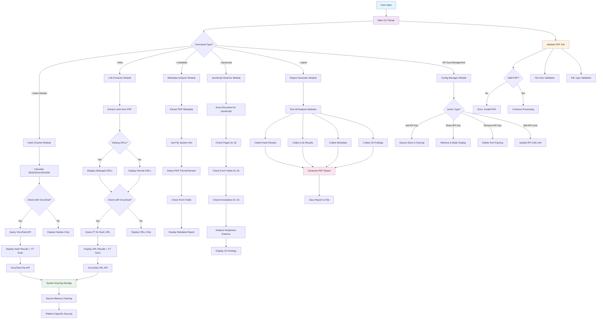

```mermaid
flowchart TD
    A[User Input] --> B[Main CLI Parser]
    B --> C{Command Type?}

    C -->|--hash-checker| D[Hash Checker Module]
    C -->|--links| E[Link Extractor Module]
    C -->|--metadata| F[Metadata Analyzer Module]
    C -->|--javascript| G[JavaScript Detector Module]
    C -->|--report| H[Report Generator Module]
    C -->|API Key Management| I[Config Manager Module]

    %% File Validation
    B --> J[Validate PDF File]
    J --> K{Valid PDF?}
    K -->|No| L[Error: Invalid PDF]
    K -->|Yes| M[Continue Processing]

    %% Hash Checker Flow
    D --> N[Calculate MD5/SHA1/SHA256]
    N --> O{Check with VirusTotal?}
    O -->|Yes| P[Query VirusTotal API]
    O -->|No| Q[Display Hashes Only]
    P --> R[Display Hash Results + VT Scan]
    R --> XX[VirusTotal File API]

    %% Link Extractor Flow
    E --> S[Extract Links from PDF]
    S --> T{Defang URLs?}
    T -->|Yes| U[Display Defanged URLs]
    T -->|No| V[Display Normal URLs]
    U --> W{Check with VirusTotal?}
    V --> W
    W -->|Yes| X[Query VT for Each URL]
    W -->|No| Y[Display URLs Only]
    X --> Z[Display URL Results + VT Scan]
    Z --> YY[VirusTotal URL API]

    %% Metadata Analyzer Flow
    F --> AA[Extract PDF Metadata]
    AA --> BB[Get File System Info]
    BB --> CC[Detect PDF Format/Version]
    CC --> DD[Check Form Fields]
    DD --> EE[Display Metadata Report]

    %% JavaScript Detector Flow
    G --> FF[Scan Document for JavaScript]
    FF --> GG[Check Pages for JS]
    GG --> HH[Check Form Fields for JS]
    HH --> II[Check Annotations for JS]
    II --> JJ[Analyze Suspicious Patterns]
    JJ --> KK[Display JS Findings]

    %% Report Generator Flow
    H --> LL[Run All Analysis Modules]
    LL --> MM[Collect Hash Results]
    LL --> NN[Collect Link Results]
    LL --> OO[Collect Metadata]
    LL --> PP[Collect JS Findings]
    MM --> QQ[Generate PDF Report]
    NN --> QQ
    OO --> QQ
    PP --> QQ
    QQ --> RR[Save Report to File]

    %% Config Manager Flow
    I --> SS{Action Type?}
    SS -->|Set API Key| TT[Secure Store in Keyring]
    SS -->|Show API Key| UU[Retrieve & Mask Display]
    SS -->|Remove API Key| VV[Delete from Keyring]
    SS -->|Edit API Limit| WW[Update API Call Limit]

    %% API Integration
    XX --> ZZ[System Keyring Storage]
    YY --> ZZ

    %% Security Features
    ZZ --> AAA[Secure Memory Clearing]
    J --> BBB[File Size Validation]
    J --> CCC[File Type Validation]
    AAA --> DDD[Platform-Specific Security]

    style A fill:#e1f5fe
    style B fill:#f3e5f5
    style J fill:#fff3e0
    style ZZ fill:#e8f5e8
    style QQ fill:#fce4ec
```